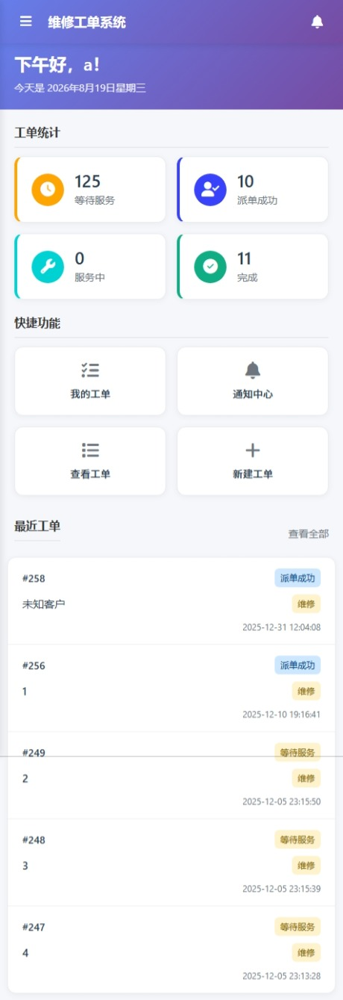
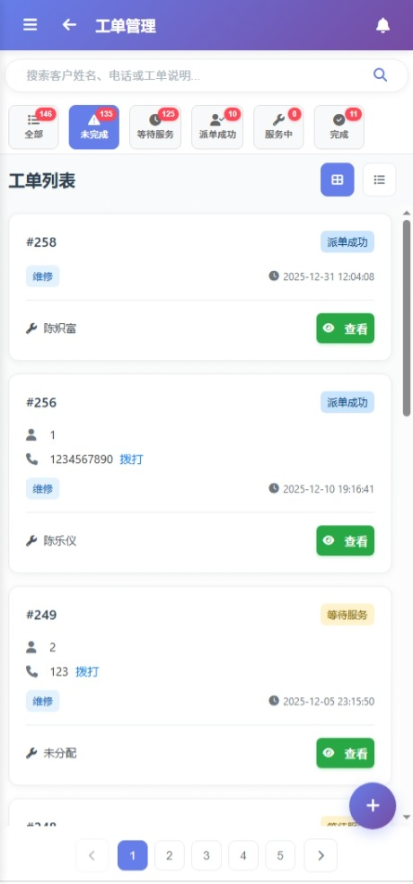
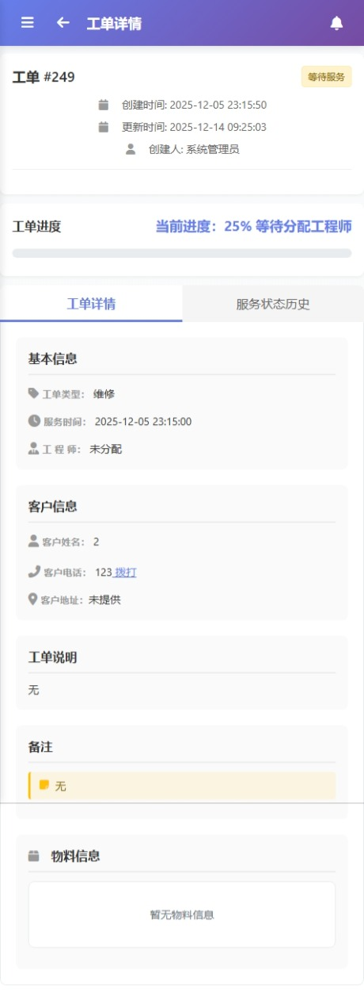
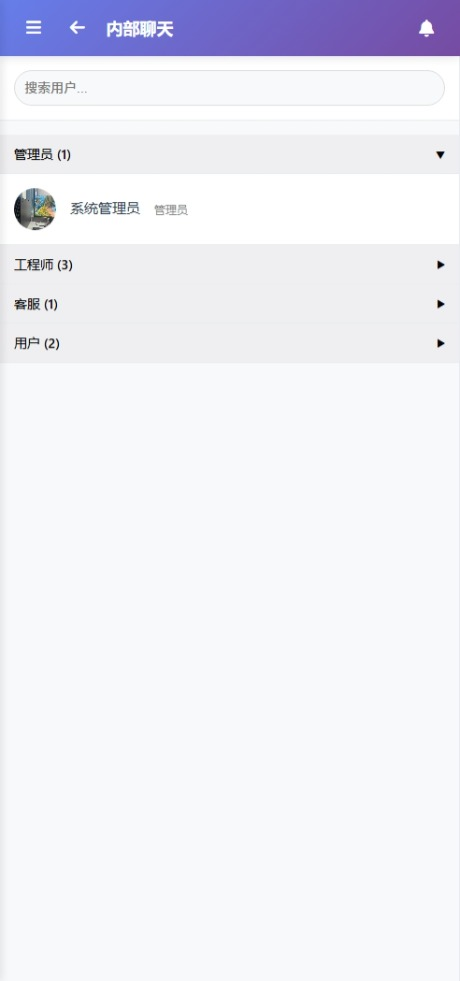
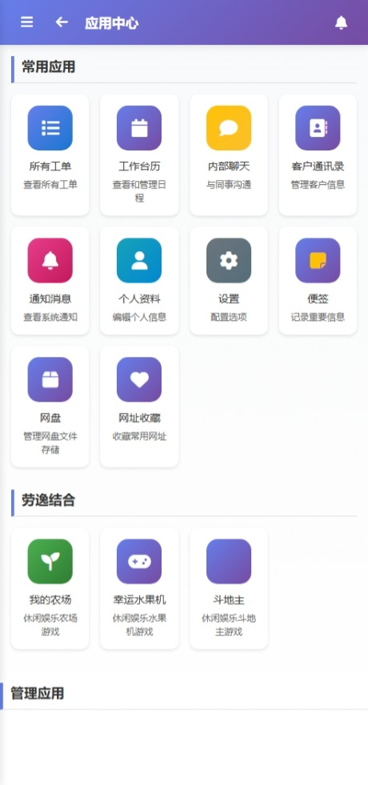
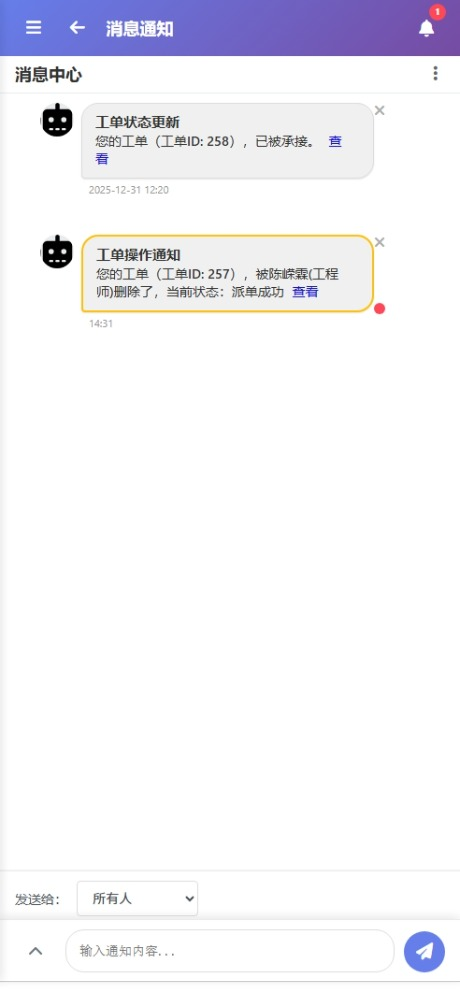
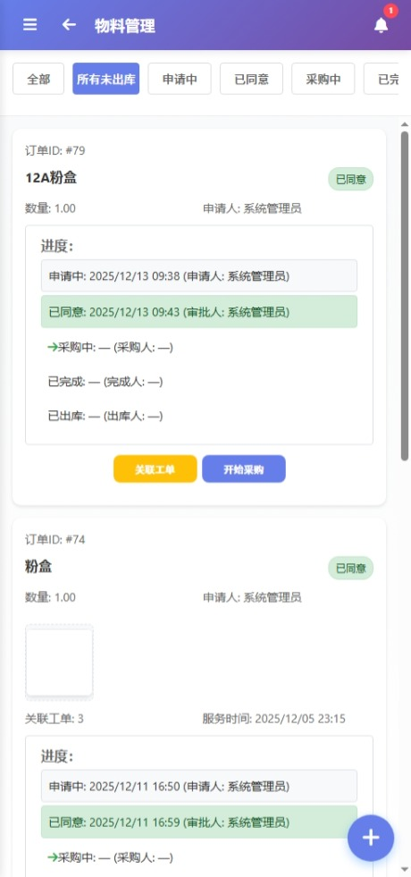

# 维修工单系统

一个完整的维修工单管理系统，支持多用户权限管理、工单跟踪和移动端适配。

## 功能特性

### 🔐 用户权限管理
- **管理员**: 系统全权限管理，用户和地址管理
- **工程师**: 承接工单、查看工单、修改工单状态
- **客服**: 新建工单、查看工单
- **普通用户**: 查看工单
- **用户角色与权限细粒度控制**

### 📋 工单管理
- 工单创建、编辑、删除
- 工单状态跟踪（等待服务、派单成功、服务中、完成）
- 工单类型分类（维修、送货、其他）
- 工单分配和承接
- 工单附件上传和管理
- 工单详情查看和历史记录

### 📱 多端支持
- 响应式设计，支持电脑端和移动端
- 现代化UI界面
- 良好的用户体验
- 移动端专用页面优化

### 🔔 消息通知
- 权限变更通知
- 新工单提醒
- 工单状态变更通知
- 未读消息角标显示
- 实时通知推送（SSE技术）

### 💬 内部聊天
- 实时聊天功能
- 聊天消息记录
- 未读消息提示

### 📦 物料管理
- 物料请求创建和管理
- 物料库存跟踪
- 物料领用记录

### 📊 系统日志
- 操作日志记录
- 自动日志清理
- 日志查询和导出

### ⚙️ 系统设置
- 公司信息管理
- 系统参数配置
- 通知设置

### 💾 数据备份
- 数据库备份功能
- 备份文件管理
- 数据恢复支持

### 🎮 农场小游戏
- 作物种植和收获
- 抽奖功能
- 农场数据统计

## 系统截图

以下为系统主要功能页面的移动端界面预览：

| 首页 / 工作台 | 工单管理 |
|:---:|:---:|
|  |  |

| 工单详情 | 内部聊天 |
|:---:|:---:|
|  |  |

| 应用中心 | 系统管理 |
|:---:|:---:|
|  |  |

| 消息通知 | 物料管理 |
|:---:|:---:|
|  |  |

## 技术栈

### 后端
- **Node.js** - 服务器运行环境
- **Express.js** - Web框架
- **MySQL** - 数据库
- **JWT** - 用户认证
- **bcryptjs** - 密码加密
- **multer** - 文件上传处理
- **sharp** - 图片处理
- **archiver** - 文件压缩
- **axios** - HTTP请求

### 前端
- **HTML5/CSS3** - 页面结构和样式
- **JavaScript (ES6+)** - 交互逻辑
- **响应式设计** - 移动端适配
- **Font Awesome** - 图标库
- **SSE** - 服务器发送事件（实时通知）

## 快速开始

### 1. 环境要求
- Node.js 16.0+
- MySQL 5.7+
- npm 或 yarn

### 2. 环境配置（可选）

如果您知道数据库配置信息，可以手动创建 `.env` 文件：

```env
PORT=80
DB_HOST=localhost
DB_USER=chenronglin
DB_PASSWORD=chenronglin
DB_NAME=repair_order_system
JWT_SECRET=your_jwt_secret_key
```

**或者**，使用自动配置向导（推荐）：
```bash
npm run configure
```

### 3. 一键启动（推荐）

#### Windows用户
```bash
# 快速启动
start.bat

# 安全启动（推荐，有详细错误提示）
start-safe.bat
```

#### Linux/Mac用户
```bash
# 快速启动
./install.sh

# 安全启动（推荐，有详细错误提示）
chmod +x start-safe.sh
./start-safe.sh
```

系统将自动：
- 🛠️ 检查并安装依赖
- 📝 检查数据库配置文件（不存在时启动配置向导）
- 🗄️ 检查数据库连接
- 🏗️ 自动创建数据库（如果不存在）
- 📋 导入数据库结构
- 🚀 启动服务器

### 4. 手动启动

#### 安装依赖
```bash
npm install
```

#### 启动服务
```bash
# 自动检查数据库并启动（推荐）
npm run setup

# 仅启动服务器
npm start

# 开发模式（自动重启）
npm run dev
```

### 5. 访问系统
打开浏览器访问: http://localhost:80

**移动端访问**: 系统会自动检测设备类型，移动端访问将重定向到移动端专用页面

**桌面端访问**: 桌面端访问将使用自动适配的桌面端界面

## 默认账号
系统会自动创建一个管理员账号：
- **用户名**: admin
- **密码**: admin123

## 项目结构

```
维修工单系统/
├── config/
│   └── database.js             # 数据库配置
├── database/
│   └── schema.sql              # 数据库结构文件
├── middleware/
│   ├── auth.js                 # 认证中间件
│   └── logMiddleware.js        # 日志中间件
├── routes/
│   ├── auth.js                 # 认证路由
│   ├── users.js                # 用户管理路由
│   ├── workOrders.js           # 工单管理路由
│   ├── notifications.js        # 通知管理路由
│   ├── addresses.js            # 地址管理路由
│   ├── chat.js                 # 聊天功能路由
│   ├── company-info.js         # 公司信息路由
│   ├── materialRequests.js     # 物料管理路由
│   ├── notes.js                # 备注路由
│   ├── storage.js              # 存储路由
│   ├── logs.js                 # 日志路由
│   ├── backup.js               # 备份路由
│   ├── settings.js             # 设置路由
│   ├── versions.js             # 版本路由
│   ├── farm.js                 # 农场小游戏路由
│   └── favorites.js            # 收藏夹路由
├── public/
│   ├── css/
│   │   ├── style.css           # 主样式文件
│   │   └── mobile-style.css    # 移动端样式文件
│   ├── js/
│   │   ├── utils.js            # 工具函数库
│   │   └── mobile-common.js    # 移动端通用脚本
│   ├── uploads/                # 文件上传目录
│   ├── login.html              # 登录页
│   ├── register.html           # 注册页
│   ├── mobile-404.html         # 移动端404页
│   ├── mobile-about.html       # 移动端关于页
│   ├── mobile-addresses.html   # 移动端地址管理页
│   ├── mobile-admin.html       # 移动端管理页
│   ├── mobile-app-center.html  # 移动端应用中心
│   ├── mobile-backup.html      # 移动端备份页
│   ├── mobile-box.html         # 移动端文件柜
│   ├── mobile-calendar.html    # 移动端日历
│   ├── mobile-chat.html        # 移动端聊天
│   ├── mobile-companyinfo.html # 移动端公司信息
│   ├── mobile-create-order.html # 移动端创建工单
│   ├── mobile-cultivation.html # 移动端种植页
│   ├── mobile-customer-contacts.html # 移动端客户联系
│   ├── mobile-dashboard.html   # 移动端仪表盘
│   ├── mobile-edit-order.html  # 移动端编辑工单
│   ├── mobile-farm.html        # 移动端农场
│   ├── mobile-favorites.html   # 移动端收藏
│   ├── mobile-index.html       # 移动端首页
│   ├── mobile-logs.html        # 移动端日志
│   ├── mobile-material-request-create.html # 移动端创建物料请求
│   ├── mobile-material-requests.html # 移动端物料请求
│   ├── mobile-my-orders.html   # 移动端我的工单
│   ├── mobile-notes.html       # 移动端备注
│   ├── mobile-notifications-settings.html # 移动端通知设置
│   ├── mobile-notifications.html # 移动端通知
│   ├── mobile-orders.html      # 移动端工单列表
│   ├── mobile-password-change.html # 移动端密码修改
│   ├── mobile-permissions.html # 移动端权限管理
│   ├── mobile-profile.html     # 移动端个人设置
│   ├── mobile-settings.html    # 移动端系统设置
│   ├── mobile-slots.html       # 移动端抽奖
│   ├── mobile-users.html       # 移动端用户管理
│   └── mobile-work-order-detail.html # 移动端工单详情
├── services/
│   └── logCleaner.js           # 日志清理服务
├── server.js                   # 服务器入口文件
├── package.json                # 项目配置
├── .env                        # 环境变量
└── README.md                   # 项目说明
```

## API 文档

### 认证接口
- `POST /api/auth/register` - 用户注册
- `POST /api/auth/login` - 用户登录
- `GET /api/auth/me` - 获取当前用户信息

### 用户管理接口
- `GET /api/users` - 获取用户列表
- `POST /api/users` - 创建用户
- `PUT /api/users/:id` - 更新用户
- `DELETE /api/users/:id` - 删除用户
- `PUT /api/users/profile/:id` - 更新个人信息
- `PUT /api/users/password/:id` - 修改密码
- `GET /api/users/:id/avatar` - 获取用户头像

### 工单管理接口
- `GET /api/work-orders` - 获取工单列表
- `GET /api/work-orders/my` - 获取我的工单
- `GET /api/work-orders/:id` - 获取工单详情
- `POST /api/work-orders` - 创建工单
- `PUT /api/work-orders/:id` - 更新工单
- `POST /api/work-orders/:id/assign` - 承接工单
- `PUT /api/work-orders/:id/status` - 更新服务状态
- `DELETE /api/work-orders/:id` - 删除工单

### 通知管理接口
- `GET /api/notifications` - 获取通知列表
- `PUT /api/notifications/:id/read` - 标记通知已读
- `PUT /api/notifications/all/read` - 标记所有通知已读
- `DELETE /api/notifications/:id` - 删除通知
- `GET /api/notifications/unread/count` - 获取未读通知数量
- `GET /api/notifications/stream` - 实时通知流

### 地址管理接口
- `GET /api/addresses` - 获取服务地址列表
- `POST /api/addresses` - 添加服务地址
- `PUT /api/addresses/:id` - 更新服务地址
- `DELETE /api/addresses/:id` - 删除服务地址

### 聊天接口
- `GET /api/chat/conversations` - 获取会话列表
- `GET /api/chat/conversations/:id/messages` - 获取会话消息
- `POST /api/chat/conversations` - 创建会话
- `POST /api/chat/messages` - 发送消息
- `GET /api/chat/unread-count` - 获取未读消息数量

### 物料管理接口
- `GET /api/material-requests` - 获取物料请求列表
- `GET /api/material-requests/:id` - 获取物料请求详情
- `POST /api/material-requests` - 创建物料请求
- `PUT /api/material-requests/:id` - 更新物料请求
- `DELETE /api/material-requests/:id` - 删除物料请求

### 公司信息接口
- `GET /api/company-info` - 获取公司信息
- `PUT /api/company-info` - 更新公司信息

### 日志管理接口
- `GET /api/logs` - 获取系统日志
- `DELETE /api/logs/:id` - 删除日志

### 备份接口
- `GET /api/backup` - 获取备份列表
- `POST /api/backup` - 创建备份
- `DELETE /api/backup/:id` - 删除备份

### 设置接口
- `GET /api/settings` - 获取系统设置
- `PUT /api/settings` - 更新系统设置

### 版本接口
- `GET /api/versions` - 获取版本信息

### 农场小游戏接口
- `GET /api/farm/crops` - 获取作物列表
- `GET /api/farm/players` - 获取玩家信息
- `GET /api/farm/inventory` - 获取库存信息
- `GET /api/farm/plots` - 获取地块信息

### 收藏夹接口
- `GET /api/favorites` - 获取收藏列表
- `POST /api/favorites` - 添加收藏
- `DELETE /api/favorites/:id` - 删除收藏

## 权限说明

### 账号类型权限
- **admin**: 所有权限
- **engineer**: 新建、查看、承接、修改工单，物料管理
- **customer_service**: 新建、查看工单，客户联系管理
- **user**: 查看工单，个人信息管理
- **warehouse_manager**: 查看工单，仓储管理

### 操作权限
- `新建`: 创建新工单、物料请求、备注
- `查看`: 查看工单列表和详情、物料信息、聊天记录
- `承接`: 承接等待服务的工单
- `修改`: 修改工单信息和状态、物料请求、客户信息
- `删除`: 删除工单、物料请求、备注、聊天记录
- `用户管理`: 管理系统用户和权限
- `地址管理`: 管理服务地址
- `仓储管理`: 管理仓储库存、物料领用记录、仓储通知
- `聊天功能`: 使用内部聊天系统
- `备份管理`: 创建和管理系统备份
- `日志管理`: 查看和管理系统日志
- `设置管理`: 修改系统设置
- `农场游戏`: 访问和使用农场小游戏功能

## 部署说明

### 生产环境部署
1. 配置生产环境变量
2. 使用 PM2 或 forever 管理进程
3. 配置 Nginx 反向代理
4. 设置 SSL 证书

### Docker 部署
```dockerfile
FROM node:16-alpine
WORKDIR /app
COPY package*.json ./
RUN npm ci --only=production
COPY . .
EXPOSE 80
CMD ["npm", "start"]
```

## 浏览器兼容性

- Chrome 60+
- Firefox 55+
- Safari 12+
- Edge 79+

## 开发说明

### 代码规范
- 使用 ES6+ 语法
- 遵循 RESTful API 设计
- 使用语义化 HTML5 标签
- 响应式设计原则

### 调试模式
开发模式下会启用详细的错误日志和调试信息。

## 常见问题

### Q: 忘记管理员密码怎么办？
A: 可以直接在数据库中修改 `users` 表中 `username='admin'` 的密码，需要使用 bcryptjs 加密。

### Q: 如何修改端口？
A: 修改 `.env` 文件中的 `PORT` 变量。

### Q: 数据库连接失败？
A: 检查 `.env` 文件中的数据库配置是否正确，确保 MySQL 服务已启动。

## 更新日志

### v1.0.0 (2026-01-19)
- 初始版本发布
- 完整的用户权限管理
- 工单管理功能
- 响应式前端界面
- 消息通知系统
- 实时聊天功能
- 物料管理系统
- 公司信息管理
- 系统日志和备份功能
- 农场小游戏功能
- 移动端专用页面优化
- 实时通知推送（SSE技术）
- 文件上传和管理功能
- 多种用户角色和权限控制

## 许可证

MIT License

## 贡献

欢迎提交 CRL 和 Pull Request！

## 联系方式

如有问题，请通过以下方式联系：
- 提交 GitHub RONGLINC93 仓库的 Pull Request 或 Issue